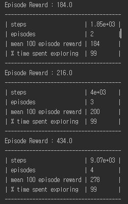
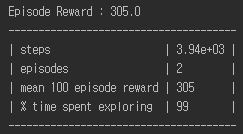

# zergling_maring_study
* The result is good enough to run a little episode, so I do not train to the end.
## What Change
* Conv layer architecture (use 1x1 and 3x3 conv)
* Attack pattern
* min distance

## Result
### Test 1

### Test 2 (one more)

## Author
Junho Kim

